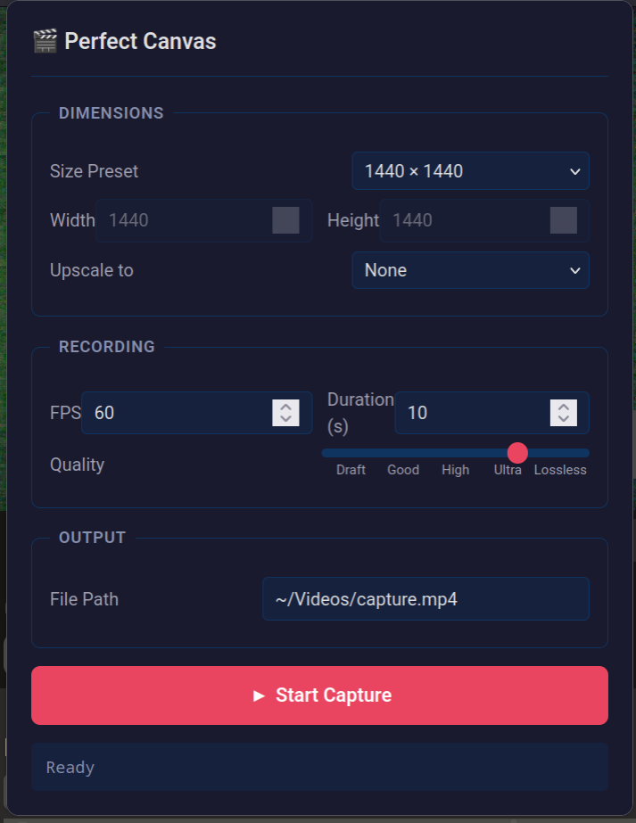

# Perfect Canvas

This is a Firefox extension to accurately capture WebGL canvas content. It's designed for algorave/visual programming tools like Hydra and Cables.gl, but should work with any WebGL canvas.



## Features

- Pixel-perfect frame-by-frame capture.
- Configurable resolution, FPS, and ffmpeg quality settings.
- Automatically resize canvas to match capture resolution (and back).
- Hydra and Cables.gl support: messes with time to ensure perfect frame timing.
- Strudel support coming soon.

## Requirements

- Firefox browser on Linux. Other systems not tested.
- Python 3.10+ with `websockets` package.
- `ffmpeg` installed and available in PATH.

## Installation

```sh
# 0. Clone this repository
git clone https://github.com/droserasprout/perfect-canvas.git

# 1. Install `ffmpeg` and `python-websockets` depending on your OS:

# - Debian/Ubuntu:
sudo apt install ffmpeg python3-websockets
# - Fedora:
sudo dnf install ffmpeg python3-websockets
# - Arch:
sudo pacman -S ffmpeg python-websockets

# 2. Install native component
cd native
sh ./install.sh

# 3. Open `about:debugging` in Firefox, click "Load Temporary Add-on", and select `manifest.json` in the project root.
```

## Roadmap

- [ ] Fix Strudel support (doesn't affect time)
- [ ] Option to select canvas if multiple are present
- [ ] Add audio capture support (tricky, but possible)
- [ ] Publish on AMO
